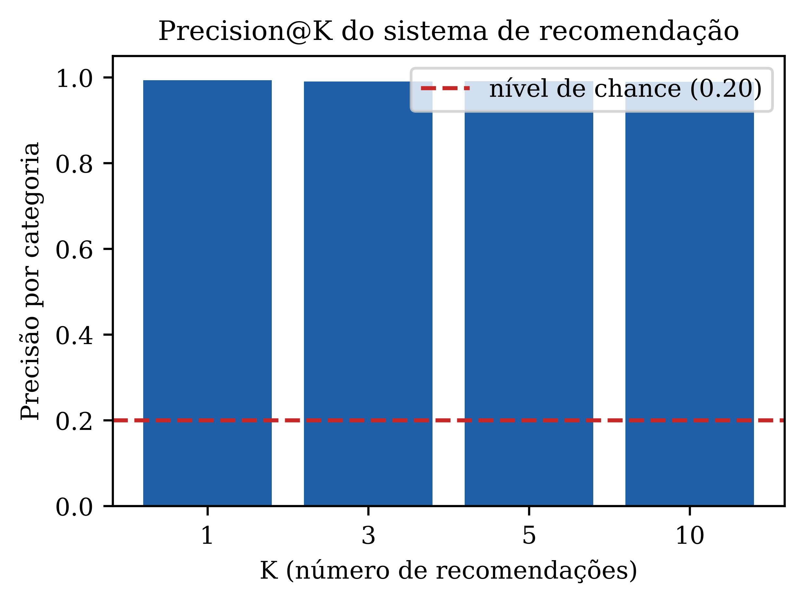

# Sistema de Recomendação por Imagens

Desafio de código da [DIO](https://www.dio.me) sobre sistemas de recomendação por similaridade visual. A proposta é recomendar produtos parecidos com base na aparência física, formato, cor e textura, sem usar nenhum dado textual como preço, marca ou modelo.

## O desafio

Treinar uma rede de Deep Learning capaz de classificar imagens de produtos por similaridade visual, cobrindo pelo menos quatro classes de objetos diferentes, cada uma com itens visualmente parecidos entre si. Dado um produto buscado, o sistema deve indicar outros produtos com aparência semelhante.

## Dataset

[Fashion Product Images Dataset](https://www.kaggle.com/datasets/paramaggarwal/fashion-product-images-small) (Kaggle, versão pequena), 44 mil fotos de produtos de moda em fundo branco, com metadados de categoria. Usei um subconjunto de **5 classes**, 150 imagens cada, 750 no total:

| Classe | Exemplo |
|---|---|
| Watches (relógios) | pulseiras metálicas e de couro, mostradores variados |
| Tshirts (camisetas) | estampas e cores variadas |
| Casual Shoes (tênis) | cores e formatos variados |
| Handbags (bolsas) | tamanhos, cores e texturas variadas |
| Sunglasses (óculos de sol) | armações e lentes variadas |

Cinco classes em vez das quatro mínimas pedidas, para dar mais variedade ao sistema de recomendação.

## Método

Em vez de treinar um classificador que aprende a separar as 5 classes, que não é realmente o que o problema pede, extraio um vetor de características visuais de cada imagem usando uma rede convolucional pré-treinada, sem a camada final de classificação:

1. **MobileNetV2**, pré-treinada na ImageNet, sem a camada de classificação, com global average pooling no final. Cada imagem vira um vetor de 1280 números, um resumo numérico da sua aparência visual, aprendido a partir de um milhão de fotos de objetos do dia a dia, não das 5 categorias específicas deste projeto.
2. **Busca por vizinhos mais próximos** entre esses vetores, usando distância de cosseno (`sklearn.neighbors.NearestNeighbors`). Dado um produto de consulta, os produtos recomendados são simplesmente os que têm o vetor de características mais próximo, ou seja, aparência mais parecida.

Não há treinamento de rede neste projeto, a MobileNetV2 já vem pronta. O trabalho de "aprendizado" acontece implicitamente: a rede aprendeu, ao ser treinada para reconhecer 1000 categorias de objetos na ImageNet, a extrair forma, textura e cor de forma genérica o suficiente para servir de descritor visual de qualquer imagem, mesmo produtos de moda que ela nunca viu rotulados como tal. É a mesma ideia de transfer learning dos outros projetos deste portfólio, aqui aplicada para extração de features em vez de classificação.

## Resultados

### Exemplos de recomendação


As recomendações capturam semelhança real de aparência, não só de categoria: o relógio de consulta, prateado com mostrador escuro quadrado, recomenda outros relógios prateados com mostrador escuro; os óculos de sol tipo aviador recomendam outros aviadores com armação metálica parecida.

### Avaliação quantitativa



Como não existe um "gabarito" de similaridade visual pronto, uso a categoria do produto como uma aproximação razoável: para cada uma das 750 imagens, busco os K vizinhos mais próximos e meço que fração pertence à mesma categoria da consulta. Se o extrator de features não capturasse nada de útil, esse valor ficaria perto do nível de chance, 20% com 5 classes balanceadas. O resultado real:

| K | Precisão por categoria |
|---|---|
| 1 | 99.3% |
| 3 | 99.1% |
| 5 | 99.1% |
| 10 | 99.0% |

Bem acima do acaso, e estável mesmo pedindo até 10 recomendações. Isso não significa que o sistema é perfeito, produtos de categorias diferentes podem ser visualmente mais parecidos entre si do que dois produtos da mesma categoria, um sapato branco e uma bolsa branca, por exemplo, e nesses casos a métrica penaliza uma recomendação que pode estar visualmente correta. Mesmo assim, um valor tão acima do nível de chance é um bom sinal de que os embeddings capturam alguma noção real de aparência.

## Como executar

```bash
python scripts/build_dataset.py           # monta o subconjunto de 750 imagens em 5 classes
python scripts/extract_features.py        # extrai os embeddings da MobileNetV2
python scripts/evaluate.py                # calcula precision@k no dataset inteiro
python scripts/recommend.py <indice>      # gera a recomendação para uma imagem do dataset
```

## Créditos

- Dataset: [Fashion Product Images Dataset](https://www.kaggle.com/datasets/paramaggarwal/fashion-product-images-small), Param Aggarwal, via Kaggle, licença MIT.
- Extrator de features: [MobileNetV2](https://keras.io/api/applications/mobilenet/), pré-treinada na ImageNet.
