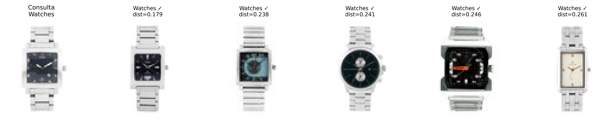
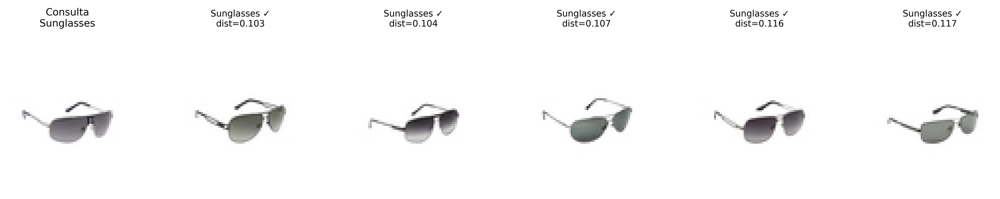
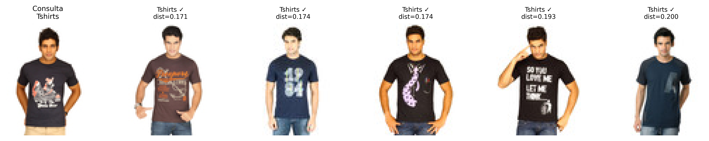
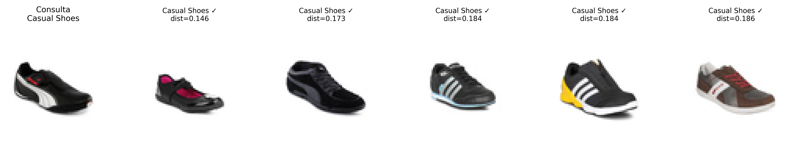
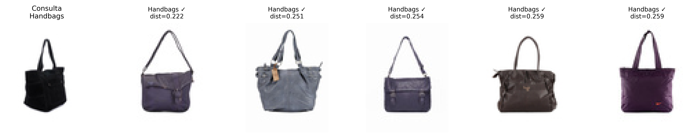
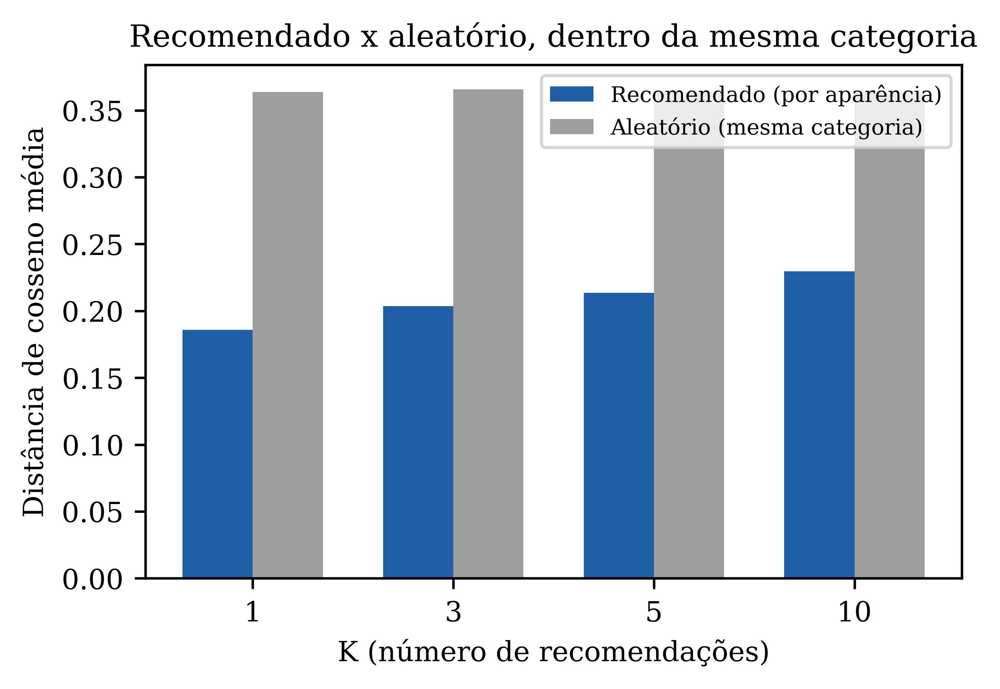

# Sistema de Recomendação por Imagens

Desafio de código da [DIO](https://www.dio.me) sobre sistemas de recomendação por similaridade visual. A proposta é recomendar produtos parecidos com base na aparência física, formato, cor e textura, sem usar nenhum dado textual como preço, marca ou modelo.

## O desafio

Treinar uma rede de Deep Learning capaz de classificar imagens de produtos por similaridade visual, cobrindo pelo menos quatro classes de objetos diferentes, cada uma com itens visualmente parecidos entre si. Dado um produto buscado, o sistema deve indicar outros produtos com aparência semelhante.

## Dataset

[Fashion Product Images Dataset](https://www.kaggle.com/datasets/paramaggarwal/fashion-product-images-small) (Kaggle, versão pequena), 44 mil fotos de produtos de moda em fundo branco, com metadados de categoria. Usei um subconjunto de **5 classes**, 150 imagens cada, 750 no total:

| Classe | Exemplo |
|---|---|
| Watches (relógios) | pulseiras metálicas e de couro, mostradores variados |
| Tshirts (camisetas) | estampas e cores variadas |
| Casual Shoes (tênis) | cores e formatos variados |
| Handbags (bolsas) | tamanhos, cores e texturas variadas |
| Sunglasses (óculos de sol) | armações e lentes variadas |

Cinco classes em vez das quatro mínimas pedidas, para dar mais variedade ao sistema de recomendação.

## Método

Em vez de treinar um classificador que aprende a separar as 5 classes, que não é realmente o que o problema pede, extraio um vetor de características visuais de cada imagem usando uma rede convolucional pré-treinada, sem a camada final de classificação:

1. **MobileNetV2**, pré-treinada na ImageNet, sem a camada de classificação, com global average pooling no final. Cada imagem vira um vetor de 1280 números, um resumo numérico da sua aparência visual, aprendido a partir de um milhão de fotos de objetos do dia a dia, não das 5 categorias específicas deste projeto.
2. **Busca por vizinhos mais próximos, restrita à mesma categoria do produto de consulta**, usando distância de cosseno (`sklearn.neighbors.NearestNeighbors`). Um relógio sempre recomenda outros relógios, um óculos de sol sempre recomenda outros óculos de sol, nunca um produto de tipo diferente por acaso ter uma aparência parecida. Dentro dessa categoria, os produtos recomendados são os que têm o vetor de características mais próximo, ou seja, a aparência mais parecida: se a consulta for um relógio Rolex, a recomendação é outro relógio visualmente parecido, não necessariamente da mesma marca.

Não há treinamento de rede neste projeto, a MobileNetV2 já vem pronta. O trabalho de "aprendizado" acontece implicitamente: a rede aprendeu, ao ser treinada para reconhecer 1000 categorias de objetos na ImageNet, a extrair forma, textura e cor de forma genérica o suficiente para servir de descritor visual de qualquer imagem, mesmo produtos de moda que ela nunca viu rotulados como tal. É a mesma ideia de transfer learning dos outros projetos deste portfólio, aqui aplicada para extração de features em vez de classificação.

## Resultados

### Exemplos de recomendação











Dentro de cada categoria, as recomendações capturam semelhança real de aparência, não só o fato de serem do mesmo tipo de produto: o relógio de consulta, prateado com mostrador escuro quadrado, recomenda outros relógios prateados com mostrador escuro, não qualquer relógio; os óculos de sol tipo aviador recomendam outros aviadores com armação metálica parecida, não qualquer óculos.

### Avaliação quantitativa

Como a busca já é restrita à mesma categoria por construção, medir "quantas recomendações são da categoria certa" não diz nada, seria sempre 100%. A pergunta que importa é outra: dentro da categoria, o ranking por aparência visual é realmente melhor do que escolher vizinhos ao acaso? Para responder, comparo, para cada produto, a distância média aos seus K vizinhos mais próximos contra a distância média a K produtos aleatórios da mesma categoria.



| K | Distância média, recomendado | Distância média, aleatório (mesma categoria) |
|---|---|---|
| 1 | 0.186 | 0.364 |
| 3 | 0.203 | 0.366 |
| 5 | 0.214 | 0.363 |
| 10 | 0.230 | 0.363 |

Quanto menor a distância de cosseno, mais parecidas as imagens. Os produtos recomendados ficam quase duas vezes mais próximos, em média, do que produtos escolhidos ao acaso dentro da mesma categoria, e essa vantagem se mantém estável de K=1 a K=10. Isso mostra que o sistema não está só acertando o tipo de produto, está de fato ordenando por aparência dentro dele.

## Como executar

`dataset/` já vem pronto neste repositório (as 750 imagens usadas nos resultados), então os dois primeiros passos abaixo só são necessários para gerar um subconjunto diferente:

```bash
kaggle datasets download -d paramaggarwal/fashion-product-images-small
unzip fashion-product-images-small.zip -d raw_data/

python scripts/build_dataset.py           # monta o subconjunto de imagens a partir de raw_data/
python scripts/extract_features.py        # extrai os embeddings da MobileNetV2
python scripts/evaluate.py                # compara recomendado x aleatorio no dataset inteiro
python scripts/recommend.py <indice>      # gera a recomendação para uma imagem do dataset
```

## Créditos

- Dataset: [Fashion Product Images Dataset](https://www.kaggle.com/datasets/paramaggarwal/fashion-product-images-small), Param Aggarwal, via Kaggle, licença MIT.
- Extrator de features: [MobileNetV2](https://keras.io/api/applications/mobilenet/), pré-treinada na ImageNet.
